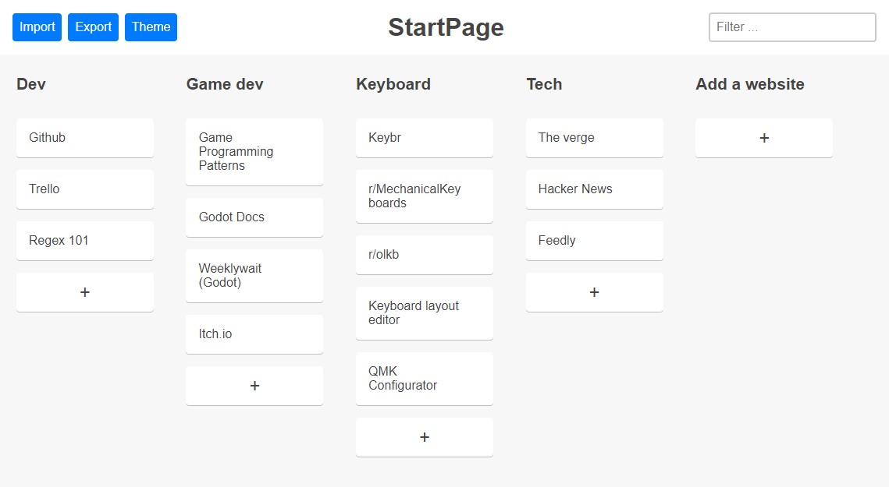
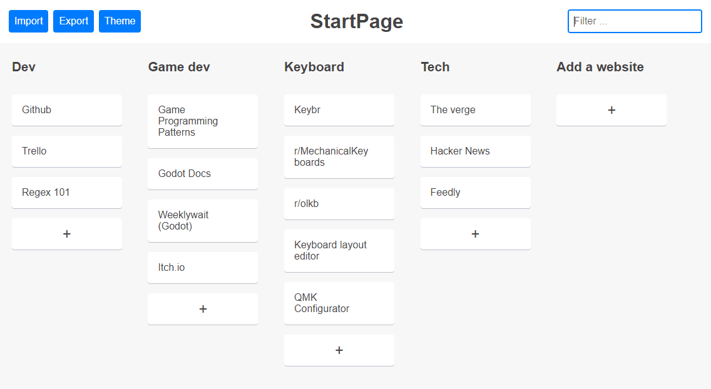
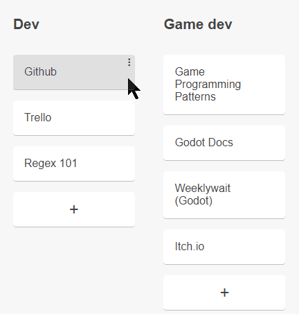

# [**Startpage**](https://serogbp.github.io/Startpage/)

# Description
**Startpage** is a kanban like page where you can save and organize your favorite websites.
The websites are stored in the browser's Local Storage and they can be exported/imported in JSON format.

Developed using vanilla Javascript with the **MVC pattern** and **Custom Elements**.

[**Try it on Github Pages**](https://serogbp.github.io/Startpage/)

# Features
- Open websites the fastest way: write in the search bar + <kbd>TAB</kbd>+<kbd>ENTER</kbd>:

The search bar will automatically focus when the page loads.

- Arrange websites and categories the way you like:

 

### More features:
- Dark and light themes
- Websites and settings stored in the browser's Local Storage
- Import and export the websites in JSON format
